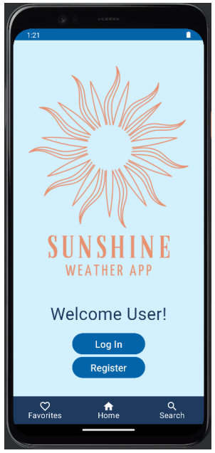
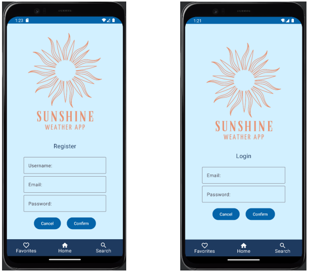
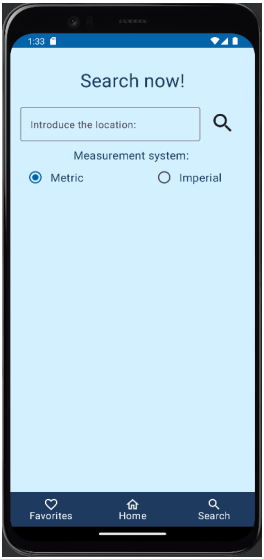
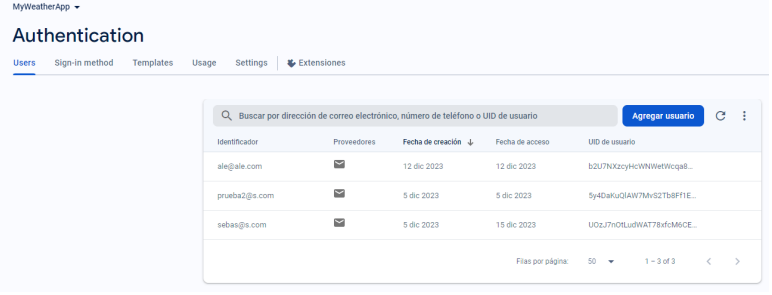
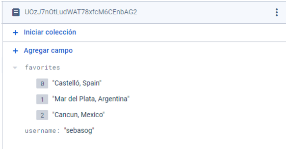
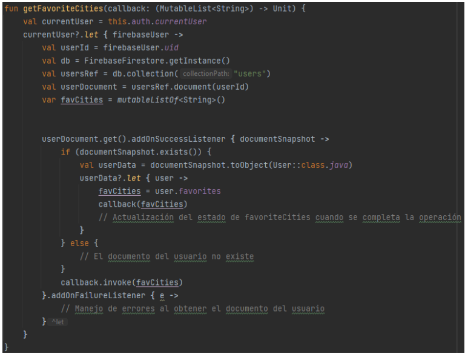
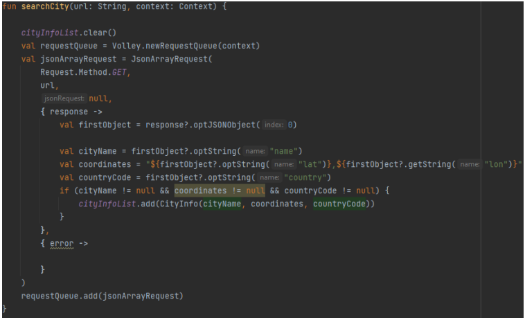
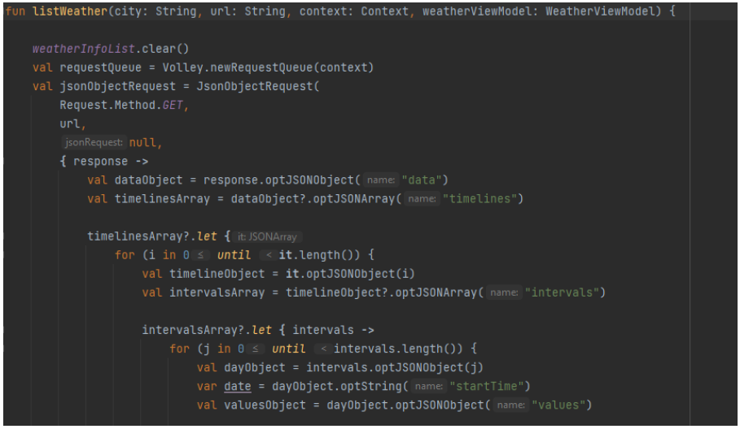
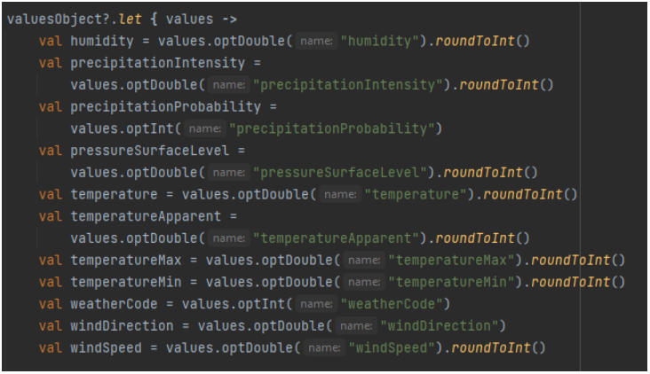

# Sunshine Weather App


## Introduction
The **Sunshine Weather App** provides weather information for various cities. It offers user authentication, favorite city management, and weather search by city name, retrieving data from OpenWeatherMap and Tomorrow.io APIs.

## Features

### Home Screen
- Welcomes the user.
- Provides login and register buttons for access.




### Login and Register Screens
- Allows users to sign in or register for an account.



### Favorites Screen
- Displays a list of favorite cities stored in Firestore Database.
- Allows logged-in users to manage their favorite cities.
- Enables users to remove cities from favorites using the heart icon.
- Facilitates navigation to weather details by tapping on the city name.


### Search Screen
- Accessible via the navigation bar or by clicking on a city name in the Favorites screen.
- Validates city information using OpenWeatherMap's Geocodes API.
- Retrieves weather data from Tomorrow.io API using the obtained coordinates.
- Presents weather information in a user-friendly format.



## Functionality Details

### Bottom Navigation Bar
- Enables fast navigation between different screens (Favorites, Home, and Search).


### Authentication (Firebase Authentication)
- Integrates Firebase Authentication for secure user sessions.



### Favorites Management
- Permits logged-in users to add or remove cities from their favorites.
- Uses Firestore Database to store and retrieve user-specific favorite cities.



### Weather Search
- Includes a city name input field for user queries.
- Validates city names using OpenWeatherMap's Geocodes API.
- Stores valid city information for weather retrieval.
- Processes weather data into a structured format for user display.

## Technology Utilized
- **Firebase Authentication:** Manages user authentication and authorization.
- **Firestore Database:** Stores user-specific data, including favorite cities.
- **OpenWeatherMap API (Geocodes):** Validates city names and retrieves location information.
- **Tomorrow.io API:** Fetches weather data based on city coordinates.

## User Flow
1. User logs in or registers via Firebase Authentication on the home screen.
2. After login, the user can access the Favorites screen to manage saved cities.
3. Users can tap on a city name in Favorites to view its weather details.
4. The navigation bar allows access to the Search screen.
5. In the Search screen, logged-in users can:
   - Add searched cities to favorites for quick access.
   - Remove cities from favorites if previously added.
6. The Tomorrow.io API fetches weather details for the searched city, which is then displayed on the screen.

## Code Implementation Overview

### Authentication (Firebase Authentication)
- Uses Firebase Authentication for login and registration.
- Methods such as `signInWithEmailAndPassword()` and `createUserWithEmailAndPassword()` are used.
- A ViewModel is implemented to maintain user authentication sessions.


### Favorites Management (Firestore Database)
- Uses Firestore Database to store user-specific favorite cities.
- Retrieves and modifies data using Firestore queries like `collection()` and `document()`.
- Data is structured in Firestore collections for efficient access.



### Weather Search (API Integration)
- Uses OpenWeatherMap's Geocodes API to validate city names and retrieve location data.
- HTTP requests are made via the **Volley** library.
- Parses JSON responses to extract city coordinates, name, and country information.

## URL Structure Examples

### Geocode API:
```
http://api.openweathermap.org/geo/1.0/direct?q=${location}&limit=1&appid=${apikey}
```

### Tomorrow.io API:
```
https://api.tomorrow.io/v4/timelines?location=${cityInfo.coordinates}&fields=temperature,temperatureApparent,humidity,windSpeed,windDirection,pressureSurfaceLevel,precipitationIntensity,weatherCode,temperatureMin,temperatureMax,precipitationProbability&timesteps=1d&units=${selectedSystem}&apikey=${apikey}
```
- `selectedSystem` refers to metric or imperial measurement systems.

## Handling API Responses
1. City information is validated using OpenWeatherMap's Geocode API.
2. Weather data is fetched from Tomorrow.io API using the retrieved city coordinates.
3. The JSON response is processed to extract relevant weather details.


## Saving Information in Data Classes
- JSON responses from APIs are parsed into corresponding data classes for structured representation.
- Examples:
  - `searchCity()` for city search results.
       
  - `listWeather()` for weather information retrieval.
       
       

---
**Author:** Sebastián Ogueta
